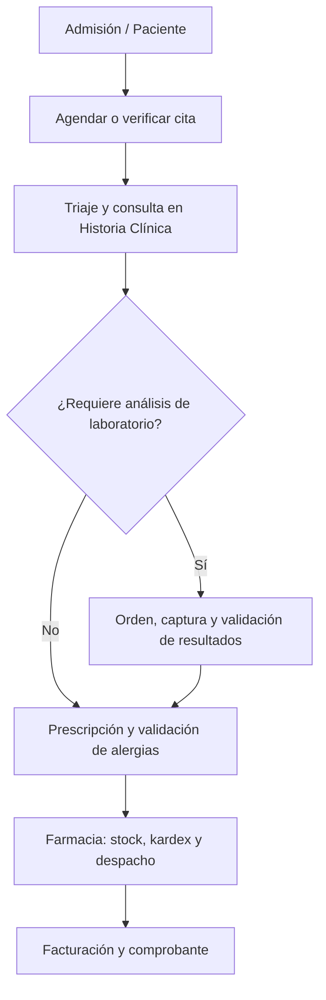
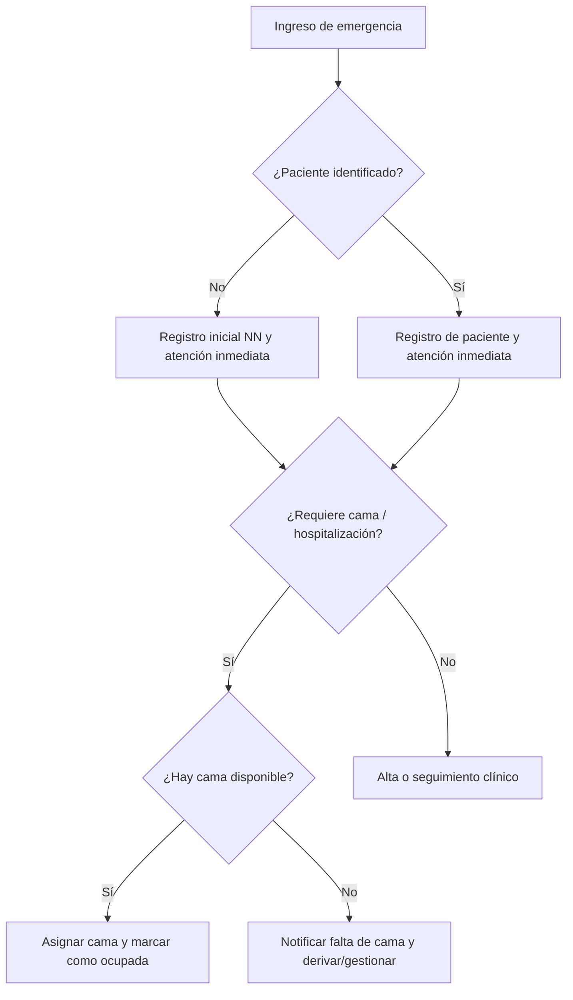
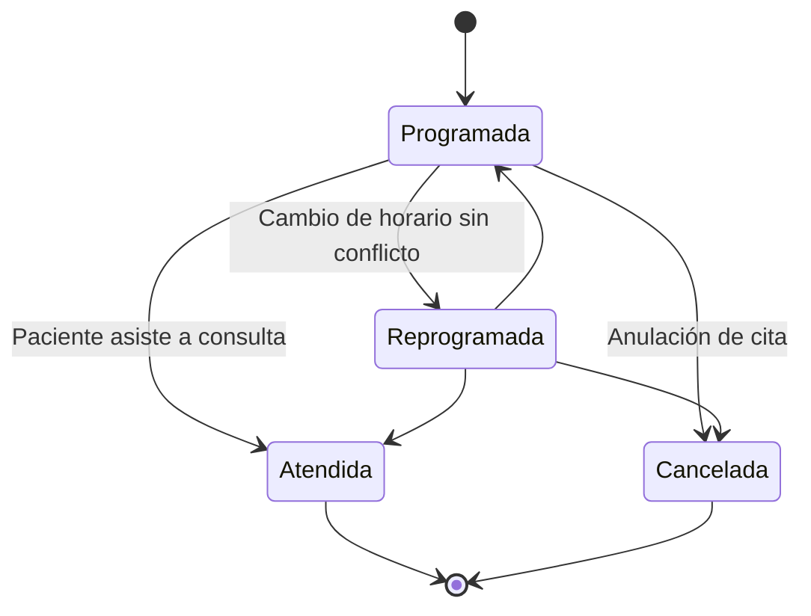

# Flujos Clínicos y Operativos — NEO_CLINIC

## 1. Flujo de atención ambulatoria y clínica

```mermaid
flowchart TD
    A[Admisión / Paciente] --> B[Agendar o verificar cita]
    B --> C[Triaje y consulta en Historia Clínica]
    C --> D{¿Requiere análisis de laboratorio?}
    D -- Sí --> E[Orden, captura y validación de resultados]
    D -- No --> F[Prescripción y validación de alergias]
    E --> F
    F --> G[Farmacia: stock, kardex y despacho]
    G --> H[Facturación y comprobante]
```

## 2. Flujo de emergencias y gestión de camas

```mermaid
flowchart TD
    A[Ingreso de emergencia] --> B{¿Paciente identificado?}
    B -- No --> C[Registro inicial NN y atención inmediata]
    B -- Sí --> D[Registro de paciente y atención inmediata]
    C --> E{¿Requiere cama / hospitalización?}
    D --> E
    E -- Sí --> F{¿Hay cama disponible?}
    F -- Sí --> G[Asignar cama y marcar como ocupada]
    F -- No --> H[Notificar falta de cama y derivar/gestionar]
    E -- No --> I[Alta o seguimiento clínico]
```

## 3. Ciclo de vida de una cita médica

```mermaid
stateDiagram-v2
    [*] --> Programada
    Programada --> Reprogramada: Cambio de horario sin conflicto
    Reprogramada --> Programada
    Programada --> Atendida: Paciente asiste a consulta
    Programada --> Cancelada: Anulación de cita
    Reprogramada --> Atendida
    Reprogramada --> Cancelada
    Atendida --> [*]
    Cancelada --> [*]
```
